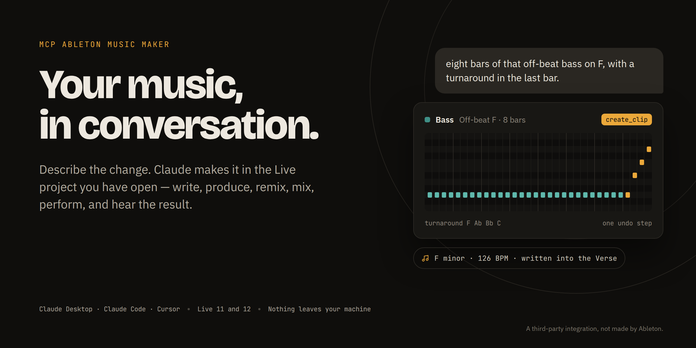
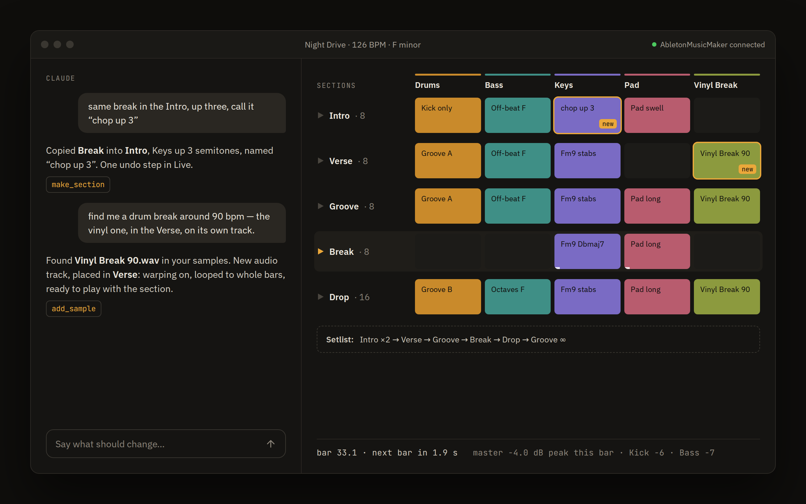

<div align="center">



<br>

[](https://github.com/defoAI/mcp-ableton-music-maker/actions/workflows/ci.yml)
[](LICENSE)

**[Download for Mac](https://github.com/defoAI/mcp-ableton-music-maker/releases/latest/download/Ableton-Music-Maker-arm64.dmg)** · **[Install](#install)** · **[What you can say](docs/what-you-can-say.md)** · **[Your data](docs/your-data.md)**

<sub>A third-party integration, not made by Ableton.</sub>

</div>

## What it does

Tell Claude what you want, and it makes the change in the Ableton Live project you have open. It writes clips, finds sounds, shapes them, arranges, mixes, listens back to the master, and plays your song live. Every change is one undo step, and nothing leaves your machine.



| If you are | Say something like |
|---|---|
| **Writing** a song | *a song in F minor at 126: intro, verse, chorus; a Rhodes, a sub bass and a tight kit* |
| **Producing** a track | *the chorus needs more lift; a fill into the drop, warmer pad, thin the verse out* |
| **Remixing** | *the vocal on its own track, and a new groove under it at 124* |
| **Making beats** | *four on the floor, offbeat hats, a ghosted snare; MPC swing on the hats* |
| **Arranging** | *drop Ghosts at bar 9 and make it 4 bars; the break twice before the drop* |
| **Mixing** | *pad down 3 dB, more reverb on the vocal — how loud is the drop now?* |
| **Performing** | *play the song. go. bring it down. again from the drop.* |
| **Learning Live** | *what is on the Bass track, and why does the chorus sound smaller?* |

Everything it can do: **[What you can say](docs/what-you-can-say.md)**. Works with Live 11 and 12, from Claude Desktop, Claude Code or Cursor.

## Install

1. **[Download the Mac app](https://github.com/defoAI/mcp-ableton-music-maker/releases/latest/download/Ableton-Music-Maker-arm64.dmg)** (Apple Silicon) and drag it to **Applications**.
2. **It is not signed by Apple yet**, so macOS will say it is damaged or cannot be checked. Run this once in Terminal:
   ```bash
   xattr -dr com.apple.quarantine "/Applications/Ableton Music Maker.app"
   ```
3. Open it and follow **Setup**. It installs the Remote Script into Live, adds the server to Claude Desktop, or gives you the command for Claude Code and Cursor.
4. Restart Live. Under **Settings → Link, Tempo & MIDI**, pick **AbletonMusicMaker** as a Control Surface, with Input and Output set to **None**.
5. Ask Claude for something.

Without the app, from source, or in Docker: **[Install](docs/install.md)**. Stuck: **[Troubleshooting](docs/troubleshooting.md)**.

## More

- [The Mac app](docs/mac-app.md): Setup, prompts to copy into Claude, activity, and a live spectrum of what Live is playing
- [Your data](docs/your-data.md): what is kept on your machine, and how to turn each part off
- [How it is built](docs/development.md): the server, the Remote Script, tests

---

<div align="center">

[Issues](https://github.com/defoAI/mcp-ableton-music-maker/issues)

Licensed under the [GNU LGPL v3.0 or later](LICENSE). Derived from AbletonMCP by [Siddharth Ahuja](https://x.com/sidahuj), [MIT](LICENSE-MIT-AbletonMCP); maintained by DefoAI UG.<br>
This is a third-party integration and not made by Ableton.

</div>
