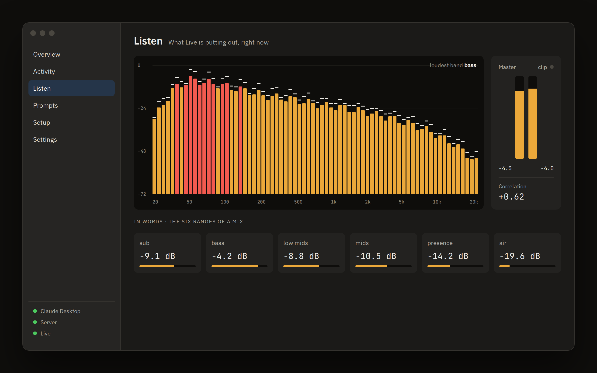

# The Mac app

A menu bar app, Tauri 2, linked against the server's own crate.

- **The chain.** Client, server, Live: one state each, one fix each. The app never runs the server your client talks to; it makes that invisible process visible, and warns when two are talking to Live.
- **Prompts.** Four finished prompts for the four states you open the app in: make a song from nothing, prepare a set you can perform, finish what you already have, build around your sample. Copy one, paste it into Claude, and it asks you what to make before it writes a note — then keeps refining until you say the mix is done, or keeps writing the next section while the current one plays. They are plain markdown in [`prompts/`](../prompts/), so you can read and paste them without the app; nothing is sent anywhere when you copy.
- **Activity.** Every tool call with its Live round-trip, the commands it sent, the result, and an estimated token cost, from the server's local log. Payloads (your MIDI and names) are shown only if you turned them on.
- **Listen.** What Live is putting out right now, through a macOS process tap of Live's process alone: no virtual audio driver, no routing change, Live keeps playing through its own output. A spectrum from 20 Hz to 20 kHz in dBFS with peak hold, master meters with a clip light, correlation, and the six ranges of a mix as their share of the whole. A small always-on-top window keeps it beside Live. The audio is analysed in memory about thirty times a second and thrown away. macOS 14.4 or later for this screen; the rest of the app runs on macOS 12.
- **Visual.** A full-screen feedback visual in the MilkDrop tradition, drawn from the same audio. Eight presets that never show you the same thing twice, because every visit re-rolls the palette, the warp, the shape and the fold, and never cut, because one becomes the next over several seconds on the same trails. Space wanders, 1–8 picks one, F is full screen.

---

[← README](../README.md)
