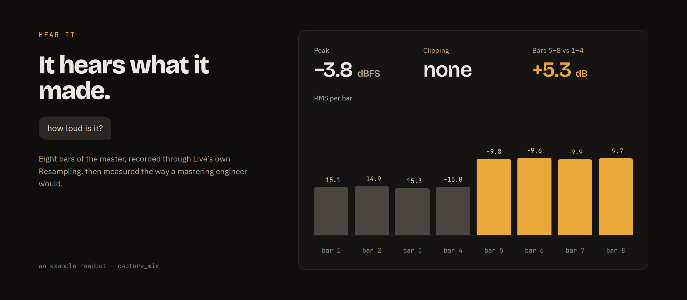
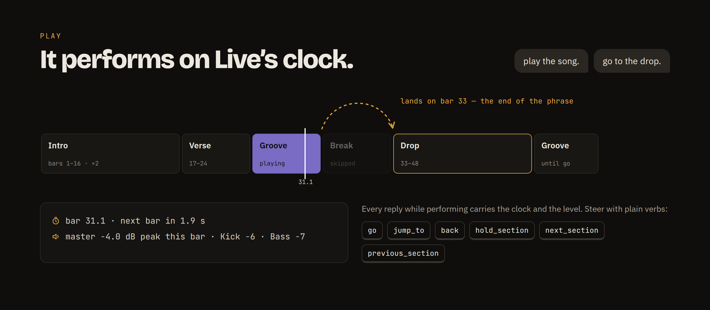

# What you can say

The server presents **the artist's set** — 39 tools, verified 2026-09-30 against `src/tools.rs` — and serves the raw layer under it as `adv_…`, never hidden. Tracks and sections are addressed by name.

| You say | What happens | Tool |
|---|---|---|
| *build me a techno set in F minor at 126 with an intro, a groove, a break and a drop, 8-bar phrases* | One document becomes the set: key, tempo, sections as scene rows, tracks with instruments found by words, clips with notes. Validated first. | `build_song` |
| *give me a piano break, Fm9 Dbmaj7 Bbm7 Ab6, two bars each* | A clip named and filled in one call. Notes as step strings, patterns, `notes_csv`, or a bar tiled across the clip. | `create_clip` `add_notes_to_clip` |
| *same break in the Intro, up three, call it "chop up 3"* | A section copied from another with per-track changes: a transposition, a variation, empty, or new notes. | `make_section` |
| *the vinyl one, on its own track; put a crash at bar 5* | Audio from your folders or Live's browser into a section's row, or at a bar. Warped, looped to whole bars, one undo. | `add_sample` |
| *put an Echo on the pad; find me an analog bass* | Instruments and effects by plain words, onto a track, a return or the master — Live's own devices, and the VST, AU and Max for Live devices you installed. Answered from the server's own index of your library once it has walked it. | `load_instrument_or_effect` `search_browser` |
| *warmer. more attack on the bass. less reverb.* | Words resolved against the rack's macros first, then the instrument's own parameters, then any parameter by name; before and after in Live's display units. Inside a rack, `in_chain` shapes the pad's own device — the snare's decay, not the rack's macro. | `shape_sound` |
| *put an MPC swing on the hats, and quantize the keys to 16ths but only 80%* | Swing, humanize, a Groove Pool groove, retime, a variation, in one call. `undo: true` puts the clip back. | `feel` |
| *drop Ghosts at bar 9 and make it 4 bars* | The Arrangement in bars: place, repeat, move, delete, shorten, list. One round trip per track however many clips. | `arrange` `create_locator` |
| *intro twice, then groove, groove with pad, break, drop, and groove to end* | The setlist, written into the set. An entry without a count loops until you say go. | `set_song` `add_to_song` `remove_from_song` |
| *play the song. go. bring it down. again from the drop.* | Fires the first section and cues the counted jumps; then steer. A transition can ramp the tempo, retime, crossfade, fill, drop or sweep. | `play_song` `go` `jump_to` `back` `hold_section` `next_section` `previous_section` |
| *click on, count-in, record 8 bars of keys from bar 17* | The producer playing, into a Session clip on the next bar; the script names it and disarms the track. | `record_clip` |
| *how loud is it? is the drop too busy?* | Eight bars of the master measured. The Capture track stays until you clear it. | `capture_mix` `clear_captures` `end_performance` |
| *remember that the sitar is the lead; park these three hooks and let me try them against the drop* | Notes about the song that come back next session, a role written into the track's name, and a `Stash:` row for candidates you fire before you commit one. | `remember` `stash` |
| *keep a copy of this set* | The whole set as a rebuildable document, written only when asked. | `export_set` `import_set` |

Plus `get_context`, which every session starts with: the set, every track with its devices and clips, the sections, the song and the clock, in one call. `delete_track`, `delete_clip` and `batch` complete the set. Every client receives this workflow at `initialize`, so the model knows it before you say anything.

Behind the artist's set are 110 tools in all: scenes and clips by index, cues with gestures (breakdown, drop, sweep, build, panic), meters, device chains (read a parameter as Live shows it, set it by that string, remove or bypass a device — on a track, a return or the master), mix snapshots, clip automation, the browser tree, sample folders. The one thing the Live API cannot do is save the set; you press Cmd+S.

## What makes it different

- **The set is the memory.** A section is a scene row named `Groove · 8`; the song is a `Setlist:` scene. Live's own Save keeps them, so nothing about your song lives in a sidecar file, and every set you already have can become one.
- **The producer's units, both ways.** Faders and meters in dB, Arrangement positions in Live's 1-based bars, note times in beats. Live's raw 0–1 fader curve and its beat times are the server's problem.
- **Validated before Live sees it.** A whole set from one document is checked end to end before the first command reaches Live, and `dry_run` shows the plan. Whatever changes, Live undoes in one step.
- **It hears what it made.** `capture_mix` records the master inside Live and reports what a mastering engineer would: peak, RMS per bar, silence, clipping, stereo correlation. A performance is kept as a take in the Arrangement, after what is already there, never over it unless you say so.
- **It performs on Live's clock.** A cue is handed to the Remote Script, which runs it on Live's own tick. A jump into a section that last ran hotter warns before it fires.
- **It stays on your machine.** One socket, to Live, on this machine only by default. No telemetry, no analytics, no dataset, no HTTP client in the dependency tree, and CI fails if one appears.

## It hears what it made

`capture_mix` records eight bars of the master through Live's own Resampling and reports what a mastering engineer would: peak, RMS per bar, silence, clipping, stereo correlation. A performance is kept as a take in the Arrangement, after what is already there, never over it unless you say so.

## Then play it like an instrument

Write the setlist into the set, press play, then steer: *go*, *again from the drop*, *bring it down*. A jump lands at the end of the playing phrase, and the Remote Script's own clock makes it land there even if the server is busy. A transition can ramp the tempo, retime, crossfade, fill, drop or sweep, and a jump into a section that last ran hotter warns before it fires.

Works with **Live 11 and 12**; Live 10 without the Arrangement tools. Placing samples needs Live 12.

---

[← README](../README.md)
